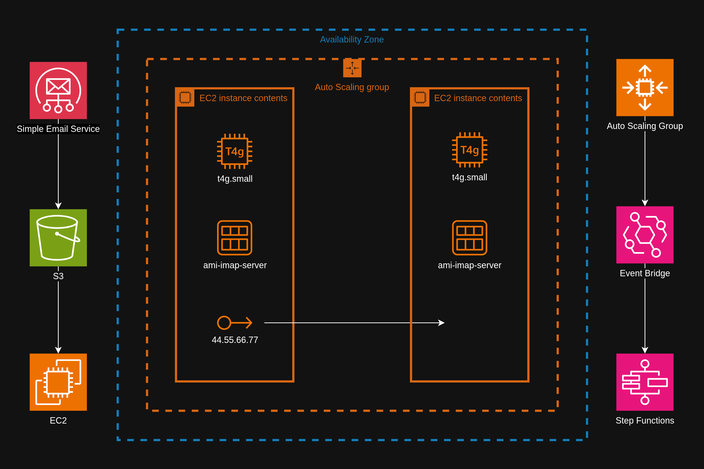

# IMAP Resilience



**Scenario:**
A mail server runs on a single EC2 instance. Clients connect to the server over IMAPS (port 993) to fetch mail. Budget allows for just one instance, and costs need to be kept as low as possible.

**Problem:**
If the instance becomes unhealthy, the admin needs to launch and configure a new instance, during which time clients cannot access their email. The recovery time should not depend on the admin's availability.

**Solution:**
Monitor instance health, so that a failed health check triggers an automatic recovery mechanism. This reduces the recovery time from hours to seconds by not requiring human intervention.

**Implementation:**
Attach an elastic IP to the instance. An Auto Scaling Group (ASG) replaces the instance when it becomes unhealthy. A lifecycle hook invokes a Step Functions state machine, which attaches the elastic IP to the new instance.

## 1. Given

Here are a few details on how the mail server functions in its current state.

### SES & S3

- Simple Email Service (SES) receives the mail and puts it in an S3 bucket.
- A script on the EC2 instance periodically fetches mail from the bucket and puts it in the mail server's mailbox directory.
- The mail server is only used for receiving mail. Email clients connect directly to SES to send mail.

### EC2

- The instance runs Amazon Linux 2023, configured with Dovecot and SSL certificates.
- The instance is saved as an Amazon Machine Image (AMI).
- The security group allows inbound port 993 from anywhere.
- The EC2 instance profile allows it to read from the S3 bucket.
- An elastic IP is attached.

### Route 53

- A domain is registered in Route 53 with a public hosted zone.
- An A record points to the elastic IP.

## 2. Replace the unhealthy instance

Half of the solution is replacing the instance when it's unhealthy, and this functionality comes out of the box with the ASG.

### ASG

The ASG needs the following:
- A launch template that includes the AMI.
- Minimum and maximum of 1 instance.
- A lifecycle hook.

Create the launch template from the AWS Management Console. Select the AMI for the mail server. Don't specify a subnet.

When creating the ASG,  specify at least two public subnets in two availability zones for high availability.

```
aws autoscaling create-auto-scaling-group \
--auto-scaling-group-name asg-imap-server \
--launch-template LaunchTemplateName=lt-imap-server,Version=1 \
--min-size 1 \
--max-size 1 \
--vpc-zone-identifier "subnet-aaaaaaaaaaaaaaaaa,subnet-bbbbbbbbbbbbbbbbb"
```

Add a lifecycle hook for when a new instance launches.

```
aws autoscaling put-lifecycle-hook \
	--lifecycle-hook-name hook-1 \
	--auto-scaling-group-name asg-imap-server \
	--lifecycle-transition autoscaling:EC2_INSTANCE_LAUNCHING
```

## 3. Attach the elastic IP

An EventBridge rule notices the lifecycle hook and invokes a Step Functions state machine to attach the EBS volume and elastic IP. Create the state machine and the EventBridge rule.

### SSM Parameter Store

The state machine needs to know the elastic IP ID. This can be stored in SSM Parameter Store.

```
aws ssm put-parameter \
    --name /imap-server/eip-id \
    --value eipalloc-xxxxxxxxxxxxxxxxx \
    --type String
```

### Step Functions

The state machine needs permission to perform the steps, so create the role ImapServerStateMachine. The role needs the following:
- [trust policy](ImapServerStateMachineTrustPolicy.json)
- [ImapServerEventBridgePolicy](ImapServerStateMachinePolicy.json)

```
aws iam create-role \
  --role-name ImapServerStateMachine \
  --assume-role-policy-document file://ImapServerStateMachineTrustPolicy.json

aws iam put-role-policy \
  --role-name ImapServerStateMachine \
  --policy-name ImapServerStateMachinePolicy \
  --policy-document file://ImapServerStateMachinePolicy.json
```

[StateMachine.json](StateMachine.json) defines the state machine. The steps are summarized as follows:

1. Get the elastic IP ID from SSM Parameter Store.
2. Associate it with the new EC2 instance.
3. If successful, complete the lifecycle action in the Auto Scaling Group.
4. Otherwise, retry, and eventually abandon the lifecycle action, resulting in failure.

```
aws stepfunctions create-state-machine \
  --name sm-imap-server \
  --definition file://StateMachine.json \
  --role-arn arn:aws:iam::<AWS_ACCOUNT_ID>:role/ImapServerStateMachine \
  --type STANDARD
```

### EventBridge

[EventBridgePattern.json](EventBridgePattern.json) is the pattern by which the rule notices the lifecycle hook.

```
aws events put-rule \
    --name "imap-server-replace" \
    --event-pattern file://event-pattern.json \
    --state ENABLED
```

The rule needs permission to invoke the Step Function, so create the role ImapServerEventBridge. The role needs the following:
- [trust policy](ImapServerEventBridgeTrustPolicy.json)
- [ImapServerEventBridgePolicy](ImapServerEventBridgePolicy.json)

Add the Step Function as a target.

```
aws events put-targets \
    --rule "imap-server-replace" \
    --targets "Id"="1","Arn"="arn:aws:states:<REGION>:<AWS_ACCOUNT_ID>:stateMachine:imap-server-replace","RoleArn"="arn:aws:iam::<AWS_ACCOUNT_ID>:role/ImapServerEventBridge"
```

## 4. Test

Initiate a test by terminating the current running EC2 instance.


